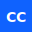

# CarbonCN Design System

<p align="center">
  
</p>

<p align="center">
  <strong>Enterprise-grade React components combining IBM Carbon Design System with shadcn/ui</strong>
</p>

<p align="center">
  <a href="#features">Features</a> •
  <a href="#getting-started">Getting Started</a> •
  <a href="#components">Components</a> •
  <a href="#for-designers">For Designers</a> •
  <a href="#export">Export</a> •
  <a href="#license">License</a>
</p>

---

## ✨ Features

- **75+ Components** - Comprehensive UI library for enterprise applications
- **Carbon Design System** - IBM's battle-tested design language
- **shadcn/ui Architecture** - Copy-paste components, full ownership
- **TypeScript First** - Complete type safety
- **Tailwind CSS** - Utility-first styling with Carbon tokens
- **Accessibility** - WCAG 2.1 AA compliant
- **Theme Support** - Light/dark mode with custom accent colors
- **Enterprise Charts** - 14 chart types built on Recharts
- **LLM-Ready Export** - Download components with AI documentation

## 🚀 Getting Started

```bash
# Clone the repository
git clone https://github.com/GaragePlug-AI/carboncn-design-system.git
cd carboncn-design-system

# Install dependencies
npm install

# Start development server
npm run dev

# Build for production
npm run build
```

## 📦 Project Structure

```
carboncn/
├── src/
│   ├── components/
│   │   ├── ui/                      # All CarbonCN components
│   │   │   ├── button.tsx
│   │   │   ├── card.tsx
│   │   │   ├── charts/              # Enterprise chart components
│   │   │   │   ├── bar-chart.tsx
│   │   │   │   ├── line-chart.tsx
│   │   │   │   ├── pie-chart.tsx
│   │   │   │   └── ...
│   │   │   └── ...
│   │   ├── showcase/                # Component showcase page
│   │   └── landing/                 # Landing page components
│   ├── context/
│   │   └── ThemeContext.tsx         # Theme provider with accent colors
│   ├── lib/
│   │   ├── utils.ts                 # cn() utility
│   │   └── export-utils.ts          # Export functionality
│   └── pages/
│       ├── LandingPage.tsx
│       └── ExportPage.tsx
├── tailwind.config.js               # Carbon design tokens
└── package.json
```

## 🧩 Components

### Categories

| Category | Components | Description |
|----------|------------|-------------|
| **Actions** | 8 | Buttons, toggles, copy buttons, menu buttons |
| **Forms** | 18 | Inputs, selects, checkboxes, date/time pickers |
| **Navigation** | 8 | Tabs, breadcrumbs, menus, side nav |
| **Data Display** | 25+ | Tables, cards, charts, tree views |
| **Feedback** | 6 | Notifications, progress, loading states |
| **Overlays** | 8 | Modals, dialogs, popovers, drawers |
| **Layout** | 6 | Separators, scroll areas, resizable panels |

### Quick Usage

```tsx
import { Button } from "@/components/ui/button"
import { Card, CardHeader, CardTitle, CardContent } from "@/components/ui/card"

function App() {
  return (
    <Card>
      <CardHeader>
        <CardTitle>Welcome</CardTitle>
      </CardHeader>
      <CardContent>
        <Button variant="primary">Get Started</Button>
      </CardContent>
    </Card>
  )
}
```

### Charts

CarbonCN includes a comprehensive charting library:

```tsx
import { CarbonBarChart } from "@/components/ui/charts/bar-chart"

<CarbonBarChart
  data={[
    { month: "Jan", revenue: 186, target: 200 },
    { month: "Feb", revenue: 205, target: 200 },
  ]}
  xKey="month"
  yKeys={["revenue", "target"]}
  height={300}
/>
```

**Available Charts:** Bar, Line, Area, Pie, Donut, Gauge, Sparkline, Combo, Heatmap, Treemap, Radar, Funnel, Scatter, Waterfall

## 🎨 For Designers

CarbonCN is built on IBM's Carbon Design System. For design resources:

### Figma Design Kit

Access the official IBM Carbon Design System Figma file with all components, colors, and typography:

**[📐 IBM Carbon Design System - Figma Community](https://www.figma.com/community/file/874592104192380079/ibm-carbon-design-system)**

### Design Tokens

| Token | Value | Tailwind Class |
|-------|-------|----------------|
| Spacing 03 | 8px | `p-carbon-03` |
| Spacing 05 | 16px | `p-carbon-05` |
| Spacing 07 | 32px | `p-carbon-07` |
| Blue 60 | #0f62fe | `bg-carbon-blue-60` |
| Gray 100 | #161616 | `bg-carbon-gray-100` |

### Typography

CarbonCN uses IBM Plex Sans and IBM Plex Mono fonts:

```css
font-family: 'IBM Plex Sans', sans-serif;
font-family: 'IBM Plex Mono', monospace;
```

## 📤 Export

CarbonCN includes a built-in export feature to download components for your project:

1. Visit the **Export** page
2. Select the components you need
3. Choose your accent color
4. Download the ZIP with:
   - Component source files
   - Tailwind configuration
   - Global CSS with theme
   - `PROMPT.md` for LLM integration
   - `README.md` with setup instructions

The exported package is ready to drop into any React + Tailwind project.

## 🌓 Theme Support

```tsx
import { ThemeProvider, useTheme } from "@/context/ThemeContext"

// Wrap your app
<ThemeProvider defaultTheme="light">
  <App />
</ThemeProvider>

// Use in components
const { theme, setTheme, accent, setAccent } = useTheme()
setTheme("dark")
setAccent("blue") // blue, green, purple, teal, orange
```

## 📋 Using Components in Your Project

1. **Copy the components** you need from `src/components/ui/`
2. **Copy utilities** from `src/lib/utils.ts`
3. **Merge CSS** from `src/index.css`
4. **Merge Tailwind config** from `tailwind.config.js`
5. **Install dependencies:**

```bash
npm install @radix-ui/react-accordion @radix-ui/react-dialog @radix-ui/react-dropdown-menu @radix-ui/react-select @radix-ui/react-tabs @radix-ui/react-tooltip class-variance-authority clsx tailwind-merge lucide-react recharts
```

6. **Install fonts:**

```bash
npm install @fontsource/ibm-plex-sans @fontsource/ibm-plex-mono
```

## 📚 References

- [Carbon Design System](https://carbondesignsystem.com/) - IBM's official design system
- [shadcn/ui](https://ui.shadcn.com/) - Re-usable component architecture
- [Tailwind CSS](https://tailwindcss.com/) - Utility-first CSS framework
- [Radix UI](https://www.radix-ui.com/) - Accessible component primitives
- [Recharts](https://recharts.org/) - Composable charting library

## 🤝 Contributing

Contributions are welcome! Please read our contributing guidelines before submitting a PR.

## 📄 License

MIT License - see [LICENSE](LICENSE) for details.

CarbonCN combines:
- **Carbon Design System** - Apache 2.0 License
- **IBM Plex Fonts** - SIL Open Font License
- **shadcn/ui patterns** - MIT License

---

<p align="center">
  Built with ❤️ by <a href="https://www.garageplug.com/">GaragePlug AI Labs</a>
</p>
